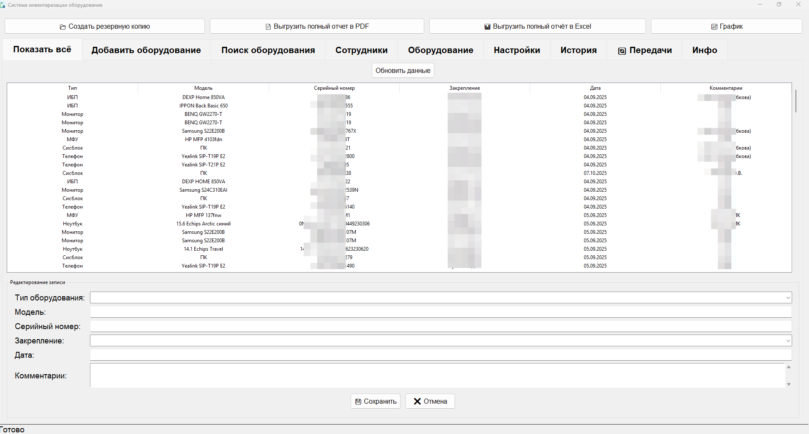

🖥️ Inventory 2.0 Система инвентаризации оборудования\
Удобное десктоп-приложение для учета IT-оборудования в компании. Поддержка поиска, фильтрации, экспорта в PDF, управления типами оборудования и настройки путей к данным.

🌟 Основные возможности \
✅ Добавление, редактирование и удаление записей об оборудовании\
✅ Поиск по любому полю\
✅ Фильтрация по сотруднику\
✅ Экспорт отчетов в PDF (полный список, по сотруднику, по поиску)\
✅ Управление типами оборудования (Монитор, Сисблок, МФУ и др.)\
✅ Резервное копирование данных\
✅ Настройка пути к файлу базы данных\
✅ Поддержка кириллицы в интерфейсе и PDF

🚀 Установка и запуск (Windows)
1. Установите Python
Скачайте и установите Python 3.10 или выше с официального сайта:\
👉 https://www.python.org/downloads/ \
❗ Важно: При установке отметьте галочку "Add Python to PATH".

2. Установите Git
Скачайте и установите Git с официального сайта:\
👉 https://git-scm.com/download/win

3. Клонируйте репозиторий\
Откройте командную строку (cmd) или PowerShell и выполните:

git clone https://github.com/Hashmaster82/inventory.git

4. Установите зависимости\
В папке проекта запустите установку зависимостей с помощью встроенного .bat-файла:
install_requirements.bat
💡 Этот файл содержит команду:\
pip install -r requirements.txt\
Он установит все необходимые библиотеки: tkinter, fpdf2, и др. 

5. Запустите приложение\
После установки зависимостей запустите приложение:\
run.bat

При первом запуске будут созданы:\
equipment_types.json — список типов оборудования.\
inventory.json — основная база (по умолчанию в сетевой папке, можно изменить в настройках).\
sotrudniki.json - Список сотрудников.\
history.json - Отражение перемещений оборудования.

⚙️ Настройки\
Путь к основной базе по умолчанию:\
\\fs\SHARE_BH\it\inventory\
Изменить его можно в приложении:\
Вкладка "Настройки" → "Выбрать другой каталог"

💡 Приложение создаст папку backups в директории с inventory.json и будет сохранять резервные копии при ручном создании. 

📄 Экспорт в PDF
Для корректного отображения кириллицы в PDF обязательно должен присутствовать файл ChakraPetch-Regular.ttf в корне проекта.
Приложение проверяет его наличие перед экспортом.

📋 Требования\
ОС: Windows 10/11 (рекомендуется)\
Python: 3.9+

Библиотеки: tkinter, fpdf2, shutil, json, datetime, webbrowser, gitpython, os

📄 Лицензия\
MIT License — вы можете свободно использовать, изменять и распространять приложение.

📬 Контакты\
Разработчик: Григорий Разин\
📧 Email: lantester35@gmail.com\
🐙 GitHub: @Hashmaster82\
🙌 Поддержка проекта\
Если проект помог вам — поставьте ⭐️ звезду на GitHub!\
Ваши идеи и баг-репорты приветствуются — создавайте Issues или Pull Requests!\
Версия: 2.0